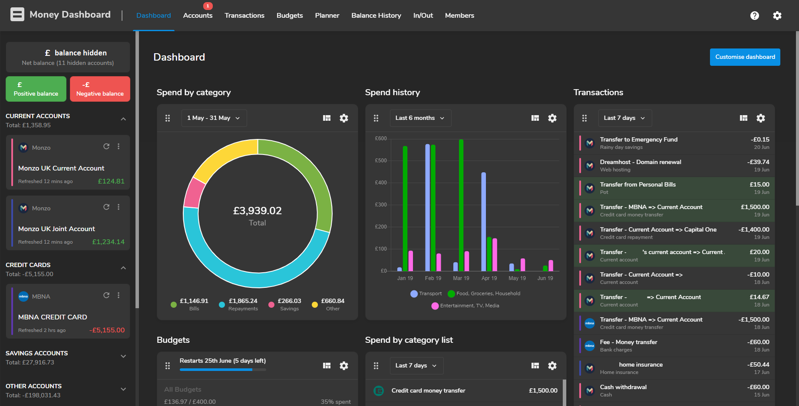
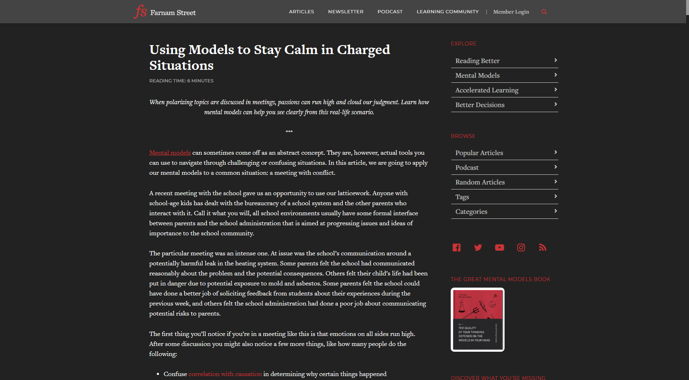
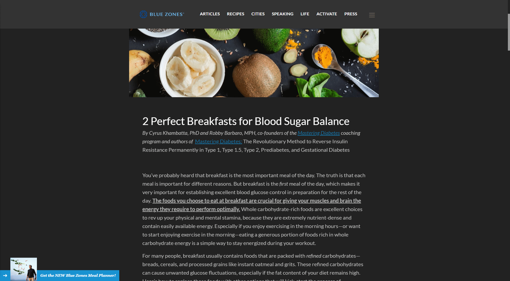

# DaemonExMachina's UserStyles

What can I say, I definitely like a dark theme! And apparently a bad pun.

| | |
| --- | --- |
| [</img>][Bitbucket Server Dark]      | <h2>[Bitbucket Server Dark]</h2>    <blockquote>Git that grows with you, *in the dark*</blockquote>               [![Get for Stylish]][bb-theme-uso] [![Install directly with Stylus]][bb-theme-github]  A dark theme for local installations of [Bitbucket Server]. Don't expect it to play nice with bitbucket.org. |
| [</img>][Jenkins Dark Ocean]           | <h2>[Jenkins Dark Ocean]</h2>       <blockquote>Build great things at any scale *and in any light*</blockquote>   [![Get for Stylish]][j-theme-uso]  [![Install directly with Stylus]][j-theme-github]   A dark theme for CI/CD platform [Jenkins], including its newer UI for Pipeline, [Blue Ocean]. |
| [</img>][Money Dashboard Dark] | <h2>[Money Dashboard Dark]</h2>     <blockquote>Staying on top of your money is easy... *on the eyes*</blockquote>[![Get for Stylish]][md-theme-uso] [![Install directly with Stylus]][md-theme-github]  A dark theme for UK-based personal finance and budgeting site [Money Dashboard]. |
| [</img>][Farnam Street After Dark]     | <h2>[Farnam Street After Dark]</h2> <blockquote>Think better. Work better. Live better. *At night.*</blockquote>  [![Get for Stylish]][fs-theme-uso] [![Install directly with Stylus]][fs-theme-github]  A dark theme for the blog [Farnam Street]. |
| [</img>][Dark Blue Zones]           | <h2>[Dark Blue Zones]</h2>          <blockquote>live longer, better, *darker*</blockquote>                        [![Get for Stylish]][bz-theme-uso] [![Install directly with Stylus]][bz-theme-github]  A dark theme for the website [Blue Zones]. |

## Buy me a coffee

Liked one of my styles enough to want to send a little tip my way? Thank you!

[![Tip with PayPal]][PayPalMe]

[Bitbucket Server]: https://bitbucket.org/product/enterprise
[Bitbucket Server Dark]: https://github.com/DaemonExMachina/userstyles/blob/master/bitbucket/README.md
[bb-theme-github]: https://raw.githubusercontent.com/DaemonExMachina/userstyles/master/bitbucket/bitbucket-server-dark.user.css
[bb-theme-uso]: https://userstyles.org/styles/156691/bitbucket-server-dark

[Jenkins]: https://jenkins.io
[Blue Ocean]: https://jenkins.io/projects/blueocean/
[Jenkins Dark Ocean]: https://github.com/DaemonExMachina/userstyles/blob/master/jenkins/README.md
[j-theme-github]: https://raw.githubusercontent.com/DaemonExMachina/userstyles/master/jenkins/jenkins-dark-ocean.user.css
[j-theme-uso]: https://userstyles.org/styles/161405/jenkins-dark-ocean

[Money Dashboard]: https://moneydashboard.com
[Money Dashboard Dark]: https://github.com/DaemonExMachina/userstyles/blob/master/money-dashboard/README.md
[md-theme-github]: https://raw.githubusercontent.com/DaemonExMachina/userstyles/master/money-dashboard/money-dashboard-dark.user.css
[md-theme-uso]: https://userstyles.org/styles/172887/money-dashboard-dark

[Farnam Street]: https://fs.blog
[Farnam Street After Dark]: https://github.com/DaemonExMachina/userstyles/blob/master/fs-blog/README.md
[fs-theme-github]: https://raw.githubusercontent.com/DaemonExMachina/userstyles/master/fs-blog/fs-blog-dark.user.css
[fs-theme-uso]: https://userstyles.org/styles/180790/farnam-street-after-dark

[Blue Zones]: https://bluezones.com
[Dark Blue Zones]: https://github.com/DaemonExMachina/userstyles/blob/master/blue-zones/README.md
[bz-theme-github]: https://raw.githubusercontent.com/DaemonExMachina/userstyles/master/blue-zones/dark-blue-zones.user.css
[bz-theme-uso]: https://userstyles.org/styles/180789/dark-blue-zones

[Tip with PayPal]: https://www.paypalobjects.com/en_GB/i/btn/btn_donate_SM.gif
[PayPalMe]: https://paypal.me/AMShepherd
[Install directly with Stylus]: https://img.shields.io/badge/Install%20directly%20with-Stylus-238b8b.svg
[Get for Stylish]: https://img.shields.io/badge/Get%20for-Stylish-blue
